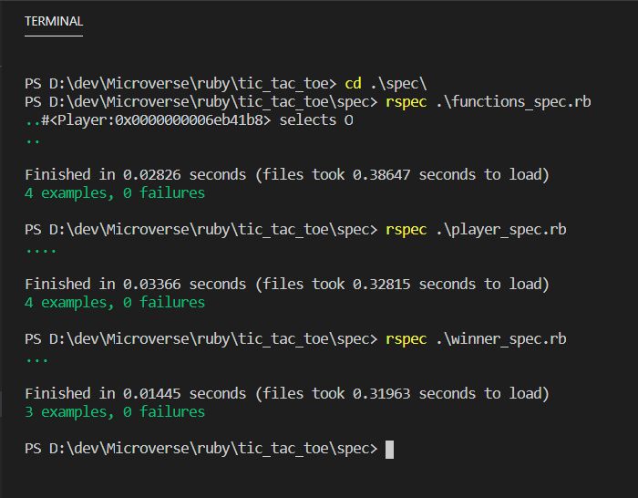

# Project Name: TicTacToe

## IMPLEMENTATION OF THE CLASSIC TIC TAC TOE Game in RUBY

```
    #######             #######               #######
        #                   #                     #
        #                   #                     #
        #    ##   ####      #    ####   ####      #     ####   ###
        #     #  #   #      #       #  #   #      #    ##  ## #   #
        #     #  #          #    ####  #          #    #    # #####
        #     #  ##         #    #  #  ##         #    ##  ## #
       ###   ###  ####     ###   #####  ####     ###    ####   ####
```

### GAMEPLAY - INTRODUCTION

### GAMEPLAY - WINNER

### RSPEC


## DESCRIPTION & HOW TO START PLAYING

### Start cmd on windows / terminal on mac or linux

- Type below commands to launch the game
  - Start a new Terminal [CMD from Run/Search on Windows]
  - Go to the game directory: cd [tic-tac-toe]
  - Type: $user-1@[...] cd [bin] & Enter [.\main.rb]
  - Hit Enter/Return & continue...
- main.rb - the entry point file is a command line executable

# GAME PLAY - Instructions

- start cmd on windows / terminal on mac or linux
- type ./main.rb & enter
- The first player enters a name and selects either 'X' or 'O'
- The second player is automatically assigned the other marker after they enter a name
- Each player has to select an available position on the display grid for their marker.
- Enter the number visible on the grid to place your marker.
- Once a number is selected hit Enter & X / O will appear on the board
- Players take turns selecting their preferred positions to make a winning move
- Winning Combinations Include: Player should have 3 markers in ONE (1) row, column or diagonal.
- The game ends in a tie if both players can not win.

## Skills Revived & Learned:

- Versioning & best coding practices, Git Flow.
- RUBY Datastructures, features etc.
- Linter - install & fix errors
- Collaborative learning, being patient, helping each other succeed.
- Self Monitoring & reliable project deliverables on due time, being focused, accountable.
- Ability to work independently and ask for help after due self research when needed.

## Learning Goals:

- Version Control, Git Flow, RSpec Tests
- Application of RUBY Syntax & Programming elements.
- User I/P & O/P via terminal / command line validation and control

## Authors

🧑‍💻 **Shabbir**

- GitHub: [@smy5152](https://github.com/smy5152)
- Twitter: [@smy5152](https://twitter.com/smy5152)
- LinkedIn: [Shabbir Yamani](https://www.linkedin.com/in/shabbirmyamani/)

🧑‍💻 **Sunil Kumar**

- GitHub: [@DsunilK](https://github.com/DsunilK)
- Linkedin: [@DsunilK](https://www.linkedin.com/in/dsunilk/)
- Twiter: [@DsunilK](https://twitter.com/D_sunil_K)

## Show your support

Give a :star:️ if you like this project!

## Contributing

Bug reports and pull requests are welcome on GitHub at https://github.com/smy5152/tic-tact-toe. This project is intended to be a safe, welcoming space for collaboration, and contributors are expected to adhere to the [code of conduct](https://github.com/smy5152/tic-tact-toe/blob/development/CODE_OF_CONDUCT.md).

## License

The gem is available as open source under the terms of the [MIT License](https://opensource.org/licenses/MIT).

## Code of Conduct

Everyone interacting in the TicTacToe project's codebases, issue trackers, chat rooms and mailing lists is expected to follow the [code of conduct](https://github.com/smy5152/tic-tact-toe/blob/development/CODE_OF_CONDUCT.md).
